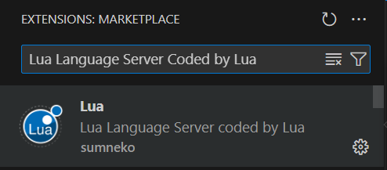
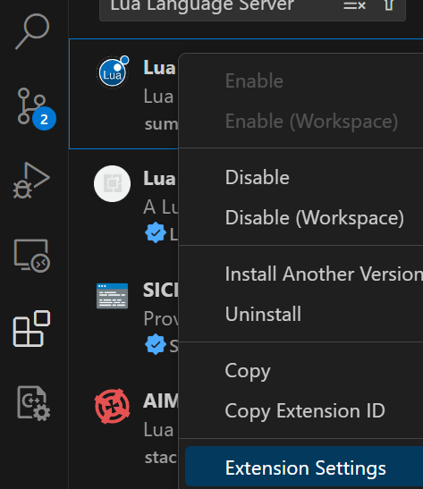
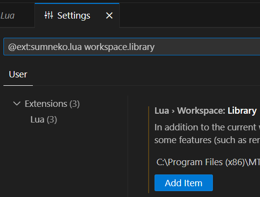
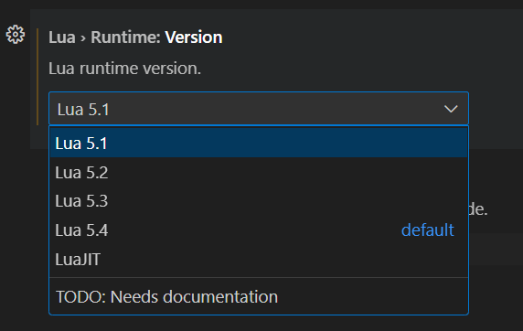

# Definition files for the Lua-Language-Server extension
The files in this repo allows you to use Lua-Language-Server extension for MTA san resources.

## Why should you care?
* The language server will inform you about all sort of problems: Type mismatches, missing function arguments, missing variables etc.
* You have access to a lot of MTA syntax/autocompletion out of the box. The syntax info will remain while writing.
* You do not have to restart your resource so often to validate if everything is working.

* [Feature list of Lua-Language-Server](https://luals.github.io/)
* [More info about annotations](https://luals.github.io/wiki/annotations/)
* [Text editors support](https://microsoft.github.io/language-server-protocol/implementors/tools/)

## Installation Lua-Language-Server extension

* [Visual Studio Code](https://marketplace.visualstudio.com/items?itemName=sumneko.lua)
    * Go to extensions:
    

    * and search for `Lua Language Server Coded by Lua` by `sumneko`

    

    * And click on the install button

* [Sublime](https://github.com/sublimelsp/LSP-lua)
    * Run the following command
        ```
            Package Control: Install Package
        ```
    * Search for `LSP` (Language Server Protocol) and click on it.
    * Repeat the same command, search for `LSP-lua` and click on it. This is for Lua language support.

## How to use the definition files?

The first step is to place the definition files at a location which you can find back.

### Visual Studio Code

In the extension settings you can set a destination folder for the definition files.

1. Right click on extension > extension settings.


2. Search for `workspace.library`



3. Click on `add item`

4. Fill in the file path of the definition files.

For example:
```
C:\Program Files (x86)\MTA San Andreas 1.6\repos\mta-annotations-for-lua-language-server
```

If that doesn't work / can't find it. Just drop the definition folder right in your project.

### Sublime

Open the settings file
```
Preferences: LSP-lua Settings
```

Add overwrite the settings with the library path. You probably need to escape the following characters `\` like this `\\`.
```JSON
// Settings in here override those in "LSP-lua/LSP-lua.sublime-settings"
{
	"settings": {
		"Lua.workspace.library": ["FOLDER PATH"]
	}
}
```

Find [here](https://luals.github.io/wiki/settings/#workspacelibrary) info about definition files in general.

## Other things to do

- [ ] Make sure to set the correct Lua runtime version in the extension config, for MTA it is: Lua 5.1


- [ ] Disable the following diagnostic for your work files (you can also do it globaly in the workspace)
```Lua
---@diagnostic disable: lowercase-global
```

- [ ] When creating definition files, disable the following diagnostics for those specific files
```Lua
---@diagnostic disable: lowercase-global
---@diagnostic disable: missing-return
```


## Known issues

- Make sure to always have an empty new line at the end of your files, as recommended in this [issue](https://github.com/LuaLS/lua-language-server/issues/2326).

- Currently, the Lua server language definition files do not have a clear separation between serverside functions/events and clientside functions/events. However, it is possible to enforce this separation for specific functions if needed.
```Lua
outputChatBox--[[@as outputChatBox_server]]("Serverside", player)
```

- In some cases, certain functions in the Lua server language definition files may return multiple types, even if you have selected a different syntax. To address this situation, you can use the `cast` or `as` notation to explicitly specify the desired type or adjust the returned type.

## Sidenote

- There are probably some mistakes in it. If you come across those, just go to the type definition files and fix it. Self service for now!

## Forcing types

### `cast` keyword

Change the type of a variable to (a) different one(s). [Wiki @cast](https://luals.github.io/wiki/annotations/#cast)

```Lua
local varName = exampleFunc()
---@cast varName string
```

```Lua
local varName = exampleFunc()
---@cast varName string | number
```

### `as` keyword

Change the type of an expression to (a) different one(s). [Wiki @as](https://luals.github.io/wiki/annotations/#as)

```Lua
local varName = exampleFunc() --[[@as string]]
```

```Lua
local varName = exampleFunc() --[[@as string | number]]
```

## Alias

Sometimes you want to use one or multiple types and re-use them at multiple places. [Wiki @alias](https://luals.github.io/wiki/annotations/#alias)

Just a small example what you can do, visit the wiki for more info.

```Lua
---@alias singleType integer
---@alias multiType string | integer
---@alias valueSpecific "verySpecific" | 555

---@param param1 singleType
---@param param2 multiType
---@param param3 valueSpecific
function example (param1, param2, param3)

end

example(123, "", "verySpecific") -- OK
example(123) -- Warning: This function requires 3 argument(s) but instead it is receiving 1.Lua Diagnostics.(missing-parameter)
example(123, 123, 555) -- OK
```

## Credits
Many thanks to Subtixx's [dataset](https://github.com/Subtixx/vscode-mtalua/tree/master). These saved me a lot of time creating all those definitions. 


Many thanks to the community for all the syntax and descriptions.

## For the newest version?
[MTA annotations for Lua-Language-Server](https://gitlab.com/IIYAMA12/mta-annotations-for-lua-language-server)

Current version 1.0.0
